<div align="center">
    
</div>

<div align="center">
    <p>Vistor Count</p>
    
</div>
<h2>About ME </h2>
Hi Guys, my name is Han Xin(韩信), BackEnd developer.
<ul>
    <li>🏫 Graduate from NUIST (Computer science and technology)</li>
    <li>💻️ BackEnd engineer at FenTaiSec.</li>
    <li>🐈️ Love some cute animal.</li>
</ul>

</table>

<!-- wakatime 统计 -->
<table align="center">
<tr>
<td valign="top">

<!--START_SECTION:waka-->

```txt
From: 11 October 2024 - To: 10 November 2024

Total Time: 87 hrs 23 mins

Go                   64 hrs 18 mins  █████████████████▓░░░░░░░   70.14 %
sh                   12 hrs 17 mins  ███▒░░░░░░░░░░░░░░░░░░░░░   13.41 %
YAML                 4 hrs 36 mins   █▒░░░░░░░░░░░░░░░░░░░░░░░   05.03 %
JSON                 4 hrs 19 mins   █▒░░░░░░░░░░░░░░░░░░░░░░░   04.71 %
Other                4 hrs 17 mins   █▒░░░░░░░░░░░░░░░░░░░░░░░   04.67 %
```

<!--END_SECTION:waka-->

</tr>
</table>

<div align="center">

</div>

### About My Technology Stack
<h4>Languages</h4>
<div>
<a href="https://github.com/ChongYanOvO">
  
</a>
<code><a href="https://go.dev/" target="_blank" rel="noreferrer"></a></code>
<code><a href="https://www.java.com/" target="_blank" rel="noreferrer">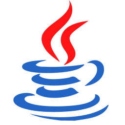</a></code>
<code><a href="https://developer.mozilla.org/zh-CN/docs/Web/JavaScript"target="_blank" rel="noreferrer">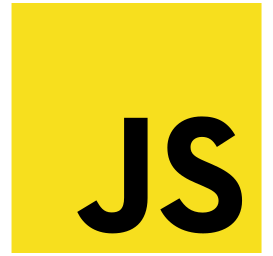</a></code>
<code><a href="https://www.typescriptlang.org/" target="_blank" rel="noreferrer"></a></code>
<code><a href="https://www.python.org/" target="_blank" rel="noreferrer"></a></code>
<code><a href="https://www.scala-lang.org/" target="_blank" rel="noreferrer">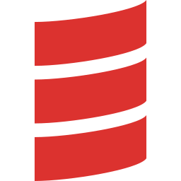</a></code>
<h4>Frontend</h4>
<code><a href="https://nodejs.org/" target="_blank" rel="noreferrer">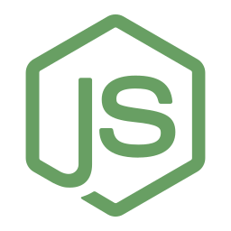</a></code>
<code><a href="https://vuejs.org/" target="_blank" rel="noreferrer"></a></code>
<code><a href="https://react.dev/" target="_blank" rel="noreferrer"></a></code>
<code><a href="https://webpack.js.org/" target="_blank" rel="noreferrer">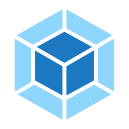</a></code>
<code><a href="https://nextjs.org/" target="_blank" rel="noreferrer"></a>
</code>
<h4>Backend</h4>
<code><a href="https://gorm.io/" target="_blank" rel="noreferrer"></a></code>
<code><a href="https://grpc.io/" target="_blank" rel="noreferrer">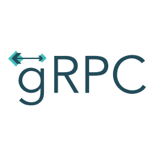</a></code>
<code><a href="https://spring.io/" target="_blank" rel="noreferrer"></a></code>
<code><a href="https://spring.io/" target="_blank" rel="noreferrer">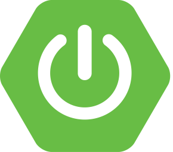</a></code>
<code><a href="https://baomidou.com/" target="_blank" rel="noreferrer">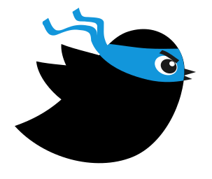</a></code>
<code><a href="https://redis.io/" target="_blank" rel="noreferrer">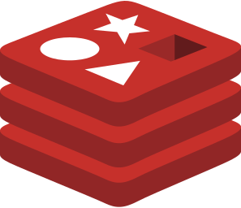</a></code>
<code><a href="https://kafka.apache.org/" target="_blank" rel="noreferrer"></a>
</code>
<h4>Big Data</h4>
<code><a href="https://hadoop.apache.org/" target="_blank" rel="noreferrer"></a></code>
<code><a href="https://hive.apache.org/" target="_blank" rel="noreferrer"></a></code>
<code><a href="https://flink.apache.org/" target="_blank" rel="noreferrer">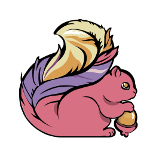</a></code>
<code><a href="https://spark.apache.org/" target="_blank" rel="noreferrer"></a></code>
<code><a href="https://clickhouse.com/" target="_blank" rel="noreferrer"></a></code>
<code><a href="https://hbase.apache.org/" target="_blank" rel="noreferrer"></a></code>
<code><a href="https://hudi.apache.org/" target="_blank" rel="noreferrer">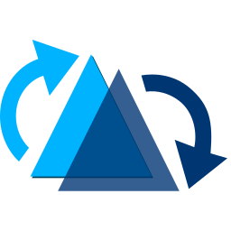</a>
</code>
<h4>Devops</h4>
<code><a href="https://www.jenkins.io/" target="_blank" rel="noreferrer"></a></code>
<code><a href="https://www.docker.com/" target="_blank" rel="noreferrer"></a></code>
<code><a href="https://kubernetes.io/" target="_blank" rel="noreferrer">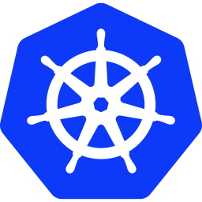</a></code>
<h4>Base Tools</h4>
<code><a href="https://git-scm.com/" target="_blank" rel="noreferrer"></a></code>
<code><a href="https://www.centos.org/" target="_blank" rel="noreferrer">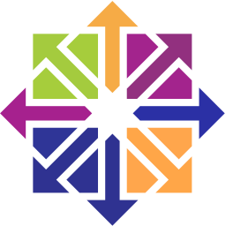</a></code>
<code><a href="https://ubuntu.com/" target="_blank" rel="noreferrer">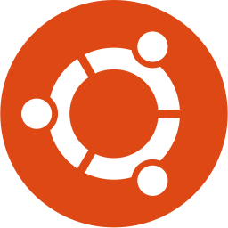</a></code>
<code><a href="https://www.kylinos.cn/" target="_blank" rel="noreferrer"></a></code>
<code><a href="https://www.mysql.com/" target="_blank" rel="noreferrer">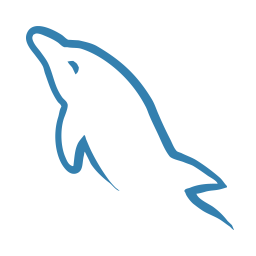</a></code>
<code><a href="https://www.postgresql.org/" target="_blank" rel="noreferrer"></a></code>
<code><a href="https://www.mongodb.com/" target="_blank" rel="noreferrer"></a></code>
</div>
